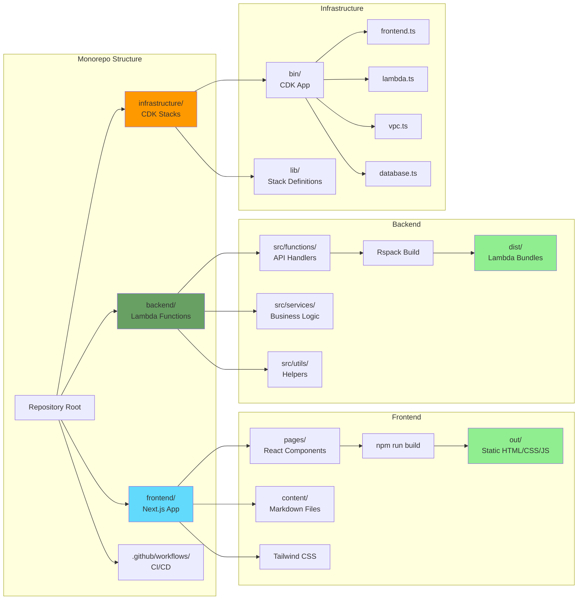
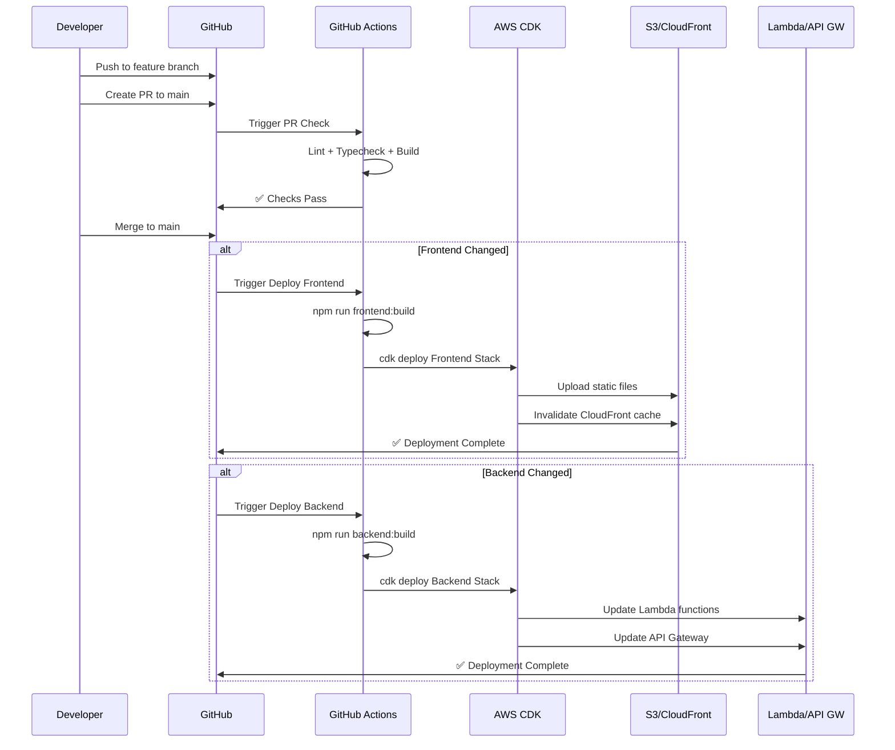

# Eriberto Lopez Portfolio

A full-stack portfolio website built with Next.js (frontend) and AWS Lambda (backend), deployed using AWS CDK.

## Architecture Overview

```mermaid
graph TB
    subgraph "Developer Workflow"
        DEV[Developer] -->|git push| GH[GitHub Repository]
    end
    
    subgraph "CI/CD Pipeline"
        GH -->|PR to main| CHECKS[PR Checks<br/>Lint/Type/Build]
        GH -->|Merge to main| DEPLOY{Path Changed?}
        DEPLOY -->|frontend/**| FE_DEPLOY[Deploy Frontend]
        DEPLOY -->|backend/**| BE_DEPLOY[Deploy Backend]
        DEPLOY -->|infrastructure/**| INFRA_DEPLOY[Deploy Infrastructure]
    end
    
    subgraph "AWS Production Environment - us-east-1"
        subgraph "Frontend Stack"
            FE_DEPLOY -->|CDK Deploy| S3[S3 Bucket<br/>Static Files]
            S3 --> CF[CloudFront CDN<br/>Global Distribution]
            CF -->|HTTPS| USERS[End Users]
        end
        
        subgraph "Backend Stack"
            BE_DEPLOY -->|CDK Deploy| APIGW[API Gateway<br/>REST API]
            APIGW --> LAMBDA[Lambda Functions<br/>Node.js 22]
            
            subgraph "VPC - Private Subnets"
                LAMBDA -->|VPC Access| RDS_PROXY[RDS Proxy]
                RDS_PROXY --> RDS[(Aurora PostgreSQL<br/>Serverless)]
                LAMBDA -.->|Optional| REDIS[(ElastiCache<br/>Redis)]
                LAMBDA -.->|Optional| SQS[SQS Queues]
            end
        end
        
        subgraph "Monitoring"
            LAMBDA --> CW_LOGS[CloudWatch Logs]
            APIGW --> CW_LOGS
            RDS --> CW_METRICS[CloudWatch Metrics]
            CW_METRICS --> ALARMS[CloudWatch Alarms]
        end
    end
    
    USERS -.->|API Calls| APIGW
    
    style USERS fill:#e1f5ff
    style CF fill:#ff9900
    style S3 fill:#ff9900
    style LAMBDA fill:#ff9900
    style RDS fill:#527fff
    style APIGW fill:#ff9900
    style GH fill:#24292e
```



## Detailed Component Architecture



## Deployment Flow



## Quick Start

### Prerequisites
- Node.js 22+
- AWS CLI configured with credentials
- Docker (for local backend development)

### Local Development

```bash
# Install dependencies
npm install
cd frontend && npm install
cd ../backend && npm install
cd ../infrastructure && npm install

# Start frontend (development mode)
npm run frontend:dev
# Visit http://localhost:3000

# Start backend locally (with LocalStack)
docker-compose up -d
npm run dev

# Build for production
npm run build
```

### Deploy to AWS

```bash
# Deploy frontend to S3 + CloudFront
npm run deploy:frontend

# Deploy backend Lambda functions
npm run deploy:backend

# Deploy all infrastructure
npm run deploy
```

## Technology Stack

### Frontend
- **Framework:** Next.js 14.2.21 with static export (`output: "export"`)
- **Language:** TypeScript
- **Styling:** Tailwind CSS v3.0
- **Content:** Markdown files with frontmatter (posts, projects, resumes)
- **Deployment:** AWS S3 + CloudFront (CDN)

**Key Features:**
- Static site generation (SSG)
- Markdown-based content management
- Responsive design with Tailwind CSS
- Blog posts, project portfolio, and resume sections

**Content Structure:**
```
frontend/content/
├── _posts/     # Blog posts
├── _projects/  # Portfolio projects
└── _resumes/   # Resume versions
```

### Backend
- **Runtime:** Node.js 22 on AWS Lambda
- **Language:** TypeScript
- **Framework:** Custom service factory pattern
- **Database:** PostgreSQL (Aurora Serverless)
- **API Gateway:** REST API with OpenAPI spec
- **Build Tool:** Rspack

**Infrastructure Components:**
- **VPC:** Private subnets for RDS/Lambda
- **Database:** Aurora PostgreSQL with RDS Proxy
- **Lambda:** API functions with VPC integration
- **API Gateway:** REST endpoints
- **IAM:** Least-privilege roles and policies

**Optional Components** (configurable):
- **ElastiCache:** Redis for caching
- **SQS:** Event queues
- **ECS Fargate:** Data pipeline containers
- **ECR:** Container registry
- **CloudWatch:** Monitoring and alarms

### Infrastructure as Code
- **Framework:** AWS CDK 2.x
- **Language:** TypeScript
- **Execution:** tsx (modern ts-node alternative)

**CDK Stacks:**
```
infrastructure/lib/
├── frontend.ts     # S3 + CloudFront
├── vpc.ts          # Network infrastructure
├── database.ts     # Aurora PostgreSQL
├── lambda.ts       # API functions
├── iam.ts          # Roles and policies
├── cache.ts        # ElastiCache (optional)
├── sqs.ts          # Message queues (optional)
├── ecr.ts          # Container registry (optional)
├── ecs.ts          # Fargate services (optional)
└── monitoring.ts   # CloudWatch alarms
```

**Configuration:**
- Stack toggles via `infrastructure/bin/project-config.ts`
- Environment configs: `local`, `dev`, `prod`
- VPC configs per environment in `infrastructure/bin/`

## CI/CD Pipeline

**GitHub Actions Workflows:**

1. **PR Check** (`pr-check.yml`)
   - Triggers: PRs to `main`
   - Actions: Lint, typecheck, build all components

2. **Deploy Frontend** (`deploy-frontend.yml`)
   - Triggers: Push to `main` with `frontend/**` changes
   - Actions: Build Next.js → Deploy to S3/CloudFront
   - Environment: Production (`ENVIRONMENT=prod`)

3. **Deploy Backend** (`deploy-backend.yml`)
   - Triggers: Push to `main` with `backend/**` changes
   - Actions: Build Lambda → Deploy via CDK

4. **Deploy Infrastructure** (`deploy-infrastructure.yml`)
   - Triggers: Push to `main` with `infrastructure/**` changes
   - Actions: CDK diff → CDK deploy

**Required GitHub Secrets:**
- `AWS_ACCESS_KEY_ID`
- `AWS_SECRET_ACCESS_KEY`
- `AWS_REGION` (us-east-1)

## Development Workflow

1. **Create feature branch** from `main`
   ```bash
   git checkout -b feature/my-feature
   ```

2. **Make changes** in relevant directory:
   - Frontend: `frontend/`
   - Backend: `backend/`
   - Infrastructure: `infrastructure/`

3. **Test locally**
   ```bash
   # Frontend
   npm run frontend:dev

   # Backend (requires Docker)
   docker-compose up -d
   npm run dev
   ```

4. **Create PR** to `main`
   - PR checks run automatically
   - Lint, typecheck, and build validation

5. **Merge to main**
   - Automatic deployment to AWS (production)
   - Only deploys changed components

## Project Configuration

**Stack Toggles** (`infrastructure/bin/project-config.ts`):
```typescript
{
  projectName: "eribertolopez",
  projectDisplayName: "Eriberto-Lopez-Portfolio",
  stacks: {
    cache: false,      // ElastiCache Redis
    sqs: false,        // SQS queues
    ecs: false,        // ECS Fargate
    ecr: false,        // Container registry
    monitoring: true   // CloudWatch (always on)
  }
}
```

**Environment Variables:**
- `ENVIRONMENT`: `local` | `dev` | `prod`
- `AWS_REGION`: `us-east-1` (production)

## Key Technical Decisions

1. **tsx over ts-node**: Faster, more reliable TypeScript execution for CDK
2. **Static Export**: Next.js generates pure HTML/CSS/JS (no Node.js server)
3. **Monorepo**: Single repository for easier development and deployment
4. **CDK over CloudFormation**: Type-safe infrastructure as code
5. **GitHub Actions**: Native CI/CD integration

## Deployment Regions

- **Production**: `us-east-1` (optimal for CloudFront)
- **Local Development**: LocalStack simulation

## Monitoring & Observability

- **CloudWatch Logs**: Lambda execution logs
- **CloudWatch Alarms**: Error rate, latency, database metrics
- **CDK Diff**: Preview infrastructure changes before deployment

## Common Commands

```bash
# Development
npm run frontend:dev              # Start frontend dev server
npm run dev                       # Start full-stack (requires Docker)

# Building
npm run frontend:build            # Build frontend static site
npm run backend:build             # Build backend Lambda bundles
npm run build                     # Build all

# Deployment
npm run deploy:frontend           # Deploy frontend only
npm run deploy:backend            # Deploy backend only
npm run deploy                    # Deploy all

# Infrastructure
cd infrastructure
npx cdk synth                     # Preview CloudFormation
npx cdk diff                      # Show infrastructure changes
npx cdk deploy --all              # Deploy all stacks
```

## Troubleshooting

**Frontend not building:**
- Check Node.js version (requires 22+)
- Verify `frontend/out/` is generated
- Check for path resolution errors in content loading

**Backend deployment fails:**
- Verify AWS credentials are configured
- Check CDK bootstrap: `npx cdk bootstrap`
- Review CloudFormation events in AWS Console

**tsx/ts-node errors:**
- Infrastructure uses `tsx` for faster execution
- Ensure `tsx` is installed: `cd infrastructure && npm install`

## Contributing

1. Fork the repository
2. Create a feature branch
3. Make your changes
4. Submit a PR to `main`
5. Ensure all CI checks pass

## License

Private portfolio project - All rights reserved.

---

**Maintained by:** Eriberto Lopez  
**Last Updated:** February 2026
