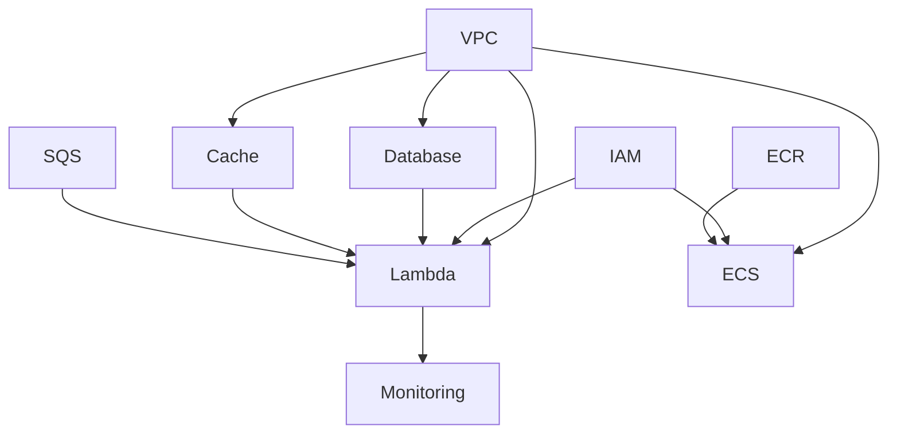

# Infrastructure

[Back to root](../README.md)

This directory contains the AWS CDK (Cloud Development Kit) infrastructure code for the Eriberto Lopez Portfolio.

## Prerequisites

- AWS CLI configured with appropriate credentials
- Node.js (version 18 or later)
- npm or yarn package manager
- AWS CDK CLI installed globally: `npm install -g aws-cdk`

## Getting Started

1. **Install dependencies:**

   ```bash
   npm install
   ```

2. **Bootstrap CDK (first time only):**

   ```bash
   npm run bootstrap
   ```

3. **Build the project:**

   ```bash
   npm run build
   ```

4. **Deploy the infrastructure:**
   ```bash
   npm run deploy
   ```

## Available Scripts

- `npm run build` - Compile TypeScript to JavaScript
- `npm run watch` - Watch for changes and compile automatically
- `npm run test` - Run tests
- `npm run cdk` - Run CDK CLI commands
- `npm run deploy` - Deploy all stacks
- `npm run destroy` - Destroy all stacks
- `npm run diff` - Show diff between deployed and local stacks
- `npm run synth` - Synthesize CloudFormation templates

## Architecture Overview

The infrastructure includes:

### Frontend

- **S3 Bucket**: Static website hosting for the React frontend
- **CloudFront Distribution**: CDN for fast global content delivery
- **Origin Access Identity**: Secure access from CloudFront to S3

### Backend

- **API Gateway**: REST API endpoints
- **Lambda Functions**: Serverless compute for API logic
- **RDS PostgreSQL**: Database for application data
- **ElastiCache Redis**: Caching layer for performance
- **SQS**: Message queue for webhook event processing

### Security

- IAM roles and policies with least-privilege access
- CORS configuration for frontend-backend communication
- HTTPS enforcement via CloudFront

### Monitoring

- **CloudWatch Alarms**:
  - Webhook signature verification error monitoring
  - Lambda function error tracking
  - RDS database connection monitoring
  - Database performance metrics (CPU, memory, latency)
  - Database connection failure detection
- **SNS Notifications**: Email alerts for critical errors
- **CloudWatch Dashboard**: Visual monitoring of system health
- **Log Metric Filters**: Automated metric extraction from Lambda logs

For detailed monitoring setup, see [MONITORING.md](./MONITORING.md)

## Environment Configuration

The stack supports different environments through environment variables:

- `ENVIRONMENT`: Environment name (dev, staging, prod)
- `CDK_DEFAULT_ACCOUNT`: AWS account ID
- `CDK_DEFAULT_REGION`: AWS region (defaults to us-west-2)
- `ALERT_EMAIL`: Email address for monitoring alerts (optional)

## Deployment

### Development

```bash
ENVIRONMENT=dev npm run deploy
```

### Production

```bash
ENVIRONMENT=prod npm run deploy
```

## Resource Naming

Resources are named with the following pattern:

- S3 Bucket: `eribertolopez-website-{account}-{region}`
- DynamoDB Tables: `eribertolopez-{resource}-{stackName}`

## Stacks

The infrastructure is organized into multiple stacks:

1. **VPC Stack**: Virtual Private Cloud and networking
2. **Database Stack**: RDS PostgreSQL cluster
3. **IAM Stack**: Identity and Access Management roles
4. **Cache Stack**: ElastiCache Redis cluster (optional)
5. **SQS Stack**: Simple Queue Service for webhook events (optional)
6. **Lambda Stack**: API Gateway and Lambda functions
7. **Monitoring Stack**: CloudWatch alarms and SNS notifications
8. **Frontend Stack**: S3 and CloudFront for static website
9. **ECS Stack**: Fargate tasks for background processing (optional)
10. **ECR Stack**: Container registry for ECS images (optional)

### Stack Dependencies



## Project Configuration

The template uses a centralized configuration in [`bin/project-config.ts`](bin/project-config.ts) that defines project naming and stack toggles.

### Core Settings

When forking this template, update these values:

```typescript
export const defaultProjectConfig: ProjectConfig = {
  projectName: "YourProject",         // PascalCase - used in stack IDs
  projectSlug: "yourproject",         // lowercase - used in S3 buckets, SSM paths
  projectDisplayName: "Your-Project", // Human-readable - used in tags
  alertEmail: "alerts@example.com",   // CloudWatch alarm notifications
};
```

### Stack Toggles

Enable or disable optional infrastructure stacks:

```typescript
stacks: {
  // Core stacks (always deployed)
  vpc: true,
  database: true,
  iam: true,
  lambda: true,
  monitoring: true,
  frontend: true,

  // Optional stacks
  cache: false,   // Redis/ElastiCache
  sqs: false,     // SQS queues
  ecs: false,     // ECS/Fargate background tasks
  ecr: false,     // ECR container registry (auto-enabled with ECS)
}
```

### Environment Variable Overrides

Stack toggles can be overridden via environment variables for CI/CD:

| Variable | Description |
|----------|-------------|
| `PROJECT_NAME` | Override `projectName` |
| `PROJECT_SLUG` | Override `projectSlug` |
| `PROJECT_DISPLAY_NAME` | Override `projectDisplayName` |
| `ALERT_EMAIL` | Override `alertEmail` |
| `ENABLE_CACHE` | Enable/disable cache stack (`true`/`false`) |
| `ENABLE_SQS` | Enable/disable SQS stack |
| `ENABLE_ECS` | Enable/disable ECS stack |
| `ENABLE_ECR` | Enable/disable ECR stack |

## Naming Convention

The template uses a centralized naming utility in [`bin/naming.ts`](bin/naming.ts) to ensure consistent resource naming across all stacks.

### Naming Patterns

| Resource Type | Pattern | Example |
|--------------|---------|---------|
| Stack ID | `{projectName}-{StackType}-Stack` | `EribertoLopez-VPC-Stack` |
| Lambda | `{projectName}-{env}-{functionName}` | `EribertoLopez-dev-Api` |
| S3 Bucket | `{projectSlug}-{env}-{purpose}` | `eribertolopez-dev-data-pipeline` |
| SSM Parameter | `/{projectSlug}/{env}/{param}` | `/eribertolopez/dev/api-endpoint` |
| SQS Queue | `{projectSlug}-{env}-{purpose}` | `eribertolopez-dev-events` |
| ElastiCache | `{projectSlug}-{env}-redis` | `eribertolopez-dev-redis` |
| Log Group | `/aws/lambda/{projectName}-{env}-{fn}` | `/aws/lambda/EribertoLopez-dev-Api` |

### Usage in Stacks

```typescript
import { NamingConvention } from "../bin/naming";

const naming = new NamingConvention(projectConfig, environment);

// Use naming methods
const lambdaName = naming.lambdaName("Api");  // "EribertoLopez-dev-Api"
const bucketName = naming.bucketName("uploads");    // "eribertolopez-dev-uploads"
const ssmPath = naming.ssmPath("api-url");          // "/eribertolopez/dev/api-url"
```

## LocalStack Development

The infrastructure supports local development via [LocalStack](https://localstack.cloud/), which emulates AWS services in Docker.

### How It Works

The `isLocalDeployment` flag controls resource creation behavior:

- **Local**: Uses simplified VPC configuration, connects to Docker-hosted PostgreSQL
- **AWS**: Uses production VPC with NAT gateways, RDS Aurora, etc.

### Docker Compose Services

| Service | Port | Description |
|---------|------|-------------|
| LocalStack | `4566` | AWS service emulation |
| PostgreSQL | `5432` | Database (not emulated, runs natively) |
| Swagger UI | `8082` | API documentation viewer |

### Local Development Commands

From the project root:

```bash
# Start Docker services
npm run local:up

# Bootstrap CDK for LocalStack
npm run local:bootstrap

# Deploy to LocalStack
npm run local:deploy

# Hot-reload development (watch + hotswap)
npm run local:dev
```

### CDK Hotswap

During local development, `npm run local:dev` uses CDK hotswap to update Lambda functions without full CloudFormation deployments, providing near-instant updates.

## Outputs

After deployment, the stacks provide the following outputs:

- Website URL (CloudFront distribution)
- API Gateway URL
- Database endpoint and credentials
- Cache endpoint and port
- SNS topic ARN for monitoring alerts
- CloudWatch dashboard URL

## Cleanup

To remove all resources:

```bash
npm run destroy
```

## Development

### Adding New Resources

1. Add the resource to `lib/ (appropriate stack file)`
2. Update any necessary IAM permissions
3. Add outputs if the resource needs to be referenced externally
4. Test with `npm run synth` before deploying

### Testing

```bash
npm run test
```

### Useful CDK Commands

- `cdk ls` - List all stacks
- `cdk synth` - Emits the synthesized CloudFormation template
- `cdk deploy` - Deploy this stack to your default AWS account/region
- `cdk diff` - Compare deployed stack with current state
- `cdk docs` - Open CDK documentation

## Troubleshooting

### Bootstrap Issues

If you encounter bootstrap issues, run:

```bash
cdk bootstrap aws://ACCOUNT-NUMBER/REGION
```

### Permission Issues

Ensure your AWS credentials have the necessary permissions for:

- CloudFormation
- S3
- CloudFront
- Lambda
- API Gateway
- DynamoDB
- IAM

## Security Considerations

- Review IAM policies regularly
- Enable CloudTrail for audit logging
- Consider enabling DynamoDB point-in-time recovery for production
- Use AWS Secrets Manager for sensitive configuration
- Enable S3 bucket versioning and MFA delete for production
